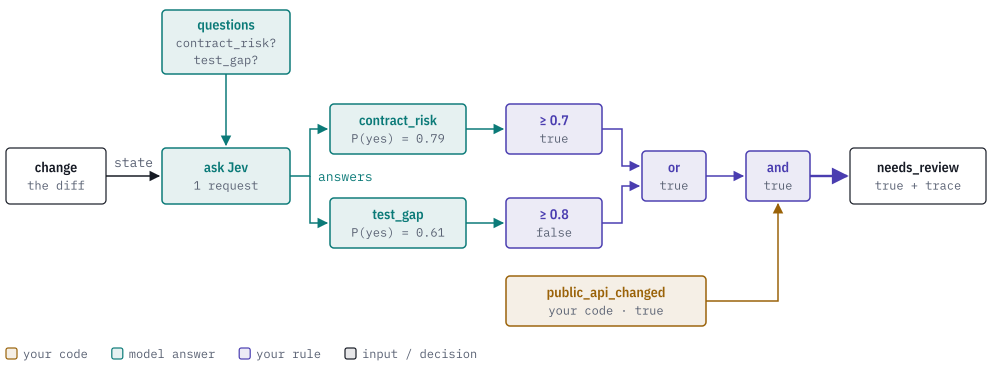

<div align="center">
  
</div>

# Sapho

[](LICENSE)
[](https://discord.gg/k8DVhuYBR2)

**Make compound decisions with System One models and rules you write.**

Sapho is a Rust library and command-line tool for making compound decisions with
System One models such as Jev. System One models cut inference time and cost
significantly, and they are fast enough to run on an M5 laptop.

Sapho splits a decision into many simple questions, asks the model each one, and
combines the answers using rules you write. Rules use logic operators such as
and, or, min and max, and you can build larger rules out of smaller ones.

Write your questions and rules in YAML or JSON. Run them from the command line,
or use Sapho in a Rust application. Keep the answers and intermediate results
so you can see how a decision was made, measure it against labelled examples,
and improve the rule.

[CLI setup](#install-the-cli) · [Rust integration](#use-sapho-in-a-rust-project) ·
[Claude Code](#use-the-skills-in-claude-code) · [Documentation](docs/index.md)

## How it works

Suppose you want to decide whether a code change needs closer review. Break that
decision into questions:

- Did the public API change?
- Could the change break an existing contract?
- Are important cases missing from the tests?

Your code can answer the first question. A model can help answer the other two.
Then a rule combines those answers. For example, you could use this policy:

```text
needs_review = public_api_changed AND
               (contract_risk >= 0.7 OR test_gap >= 0.8)
```

You choose the questions, the meaning of each answer, and the thresholds.
Sapho runs the steps and returns the decision with a trace of the work that
produced it.


Here is that rule running on a real change, one that shortens a default
timeout from 30 seconds to 5:

<picture>
  <source media="(prefers-color-scheme: dark)" srcset="docs/images/how-it-works-dark.svg">
  
</picture>

1. **Ask small questions.** Sapho sends the change and both questions to Jev
   in one request. Jev does not write an explanation. For each question it
   returns how likely each answer is: 0.79 that the change could break a
   caller, and 0.61 that its tests miss new behavior.
2. **Apply your rule.** Each probability is compared with its threshold.
   0.79 clears 0.7; 0.61 misses 0.8. `or` and `and` join those results with
   the fact your code supplied.
3. **Get the decision and its trace.** `needs_review` is true. The trace keeps
   the request, Jev's answers and every intermediate value, so you can see
   which question decided it.

Because the answers are numbers, changing a threshold changes the decision
without asking the model again. That is what lets you measure and tune a rule
against labelled examples cheaply. [How Sapho works](docs/how-it-works.md)
covers answer types, combining strengths, layered questions, guards and
collections.

## Install the CLI

You need Rust 1.98 or later and access to this repository. The checkout pins
Rust 1.98.1.

```sh
git clone https://github.com/agent-ix/sapho.git
cd sapho
cargo install --path crates/sapho-cli --locked
```

## Try it offline

The repository includes Jev's recorded answers for the change above. Replay
them; no key or network is needed:

```sh
sapho replay examples/graphs/code-review.yaml \
  --input examples/data/code-review-input.json \
  --recording examples/recordings/code-review.json
```

The JSON report's `outputs` hold the decision and both probabilities, and its
`trace` holds every step. To see just the outputs, pipe the report through
`jq '.outputs | map_values(.value.value)'`:

```json
{"contract_risk": 0.79, "needs_review": true, "test_gap": 0.61}
```

Now try a more lenient policy. [`code-review-relaxed.yaml`](examples/graphs/code-review-relaxed.yaml)
asks the same questions but raises both thresholds to 0.9:

```sh
sapho replay examples/graphs/code-review-relaxed.yaml \
  --input examples/data/code-review-input.json \
  --recording examples/recordings/code-review.json
```

`needs_review` is now false. The questions did not change, so the same
recorded answers were reused. Only your rule changed.

To use a decision in CI, add `--fail-on needs_review`. The command exits 1
when review is needed and 0 when it is not. Configuration or execution
failures exit 2. Reports go to stdout and diagnostics to stderr.

## Ask Jev yourself

Install the CLI with Jev support:

```sh
cargo install --path crates/sapho-cli --locked --features jev
```

A graph names its model backend (`judge` here); a bindings file says which
model that is. Save this as `bindings.yaml`:

```yaml
judge:
  provider: jev
  model: jev-1.13.0
  expected_model: jev-1.13.0
  distribution_policy: {kind: strict}
```

Set `TYPESAFE_API_KEY` in your environment. Put your own diff in `input.json`
as `{"change": "…", "public_api_changed": true}`, then run:

```sh
sapho run examples/graphs/code-review.yaml --input input.json --bindings bindings.yaml
```

Each run makes one request to Jev. To save the answers for replay, use
`sapho record` with the same arguments plus `--recording saved.json`. [Improve a rule](docs/improve-a-rule.md) shows how to
measure a rule against labelled cases and compare candidates offline. To use
an existing CLM service instead of Jev, see [CLM setup](docs/cli-guide.md#bind-clm-explicitly).

## What Sapho gives you

- **Questions and rules in YAML or JSON.** Yes/no, choice and score questions;
  logic, thresholds and strength combinations; reusable subgraphs.
- **Models and code in one decision.** Use the Jev or CLM adapter, or register
  your own Rust functions and model backends.
- **Layers, guards and collections.** Feed one answer into the next question,
  ask an expensive question only when needed, and apply a rule to every item.
- **Evidence you can reuse.** Record answers, replay them offline, measure a
  rule against labels, compare candidates and export training data.
- **Checks before a run and limits during it.** Types and connections are
  checked before evaluation. Model calls, items, concurrency, data and time
  are bounded.

## Use Sapho in a Rust project

Use the library when your application needs custom extraction, Rust functions
or model backends. The stock CLI runs graphs with data operations and its
configured Jev or CLM adapter; your registered Rust functions belong in an
application host.

Add these dependencies to your application's `Cargo.toml`:

```toml
[dependencies]
sapho = { git = "https://github.com/agent-ix/sapho.git" }
tokio = { version = "1", features = ["macros", "rt-multi-thread"] }
```

For local development, use `sapho = { path = "../sapho" }` instead, adjusting
the path to your checkout. Add `features = ["jev"]` to the Sapho dependency
when you need the included Jev adapter.

Copy [`examples/graphs/review.yaml`](examples/graphs/review.yaml) to your
application's root. It flags a statement for review when its support is below
0.8. Put this code in `src/main.rs`:

```rust
//! A minimal Sapho decision in a Rust application.

use sapho::{
    core::{BackendRegistry, Datum, PrimitiveRegistry, Probability, Value},
    graph::{GraphSpec, compile},
    runtime::{Engine, RunLimits},
};
use std::collections::BTreeMap;

#[tokio::main]
async fn main() -> Result<(), Box<dyn std::error::Error>> {
    let spec = GraphSpec::parse(include_str!("../review.yaml"))?;
    let graph = compile(&spec, &PrimitiveRegistry::default())?;
    let engine = Engine::new(graph, BackendRegistry::default())?;
    let inputs = BTreeMap::from([(
        "support".into(),
        Datum::new("statement-1", Value::Probability(Probability::new(0.7)?))?,
    )]);

    let run = engine.run(&inputs, RunLimits::default()).await?;
    for (name, datum) in &run.outputs {
        println!("{name}: {:?}", datum.value);
    }
    Ok(())
}
```

Run `cargo run`. It prints `needs_review: Boolean(true)` without calling a
model. For a model-based rule, register its backends before constructing the
engine. For custom Rust steps, register functions before compiling the graph.
The [Rust user guide](docs/user-guide.md) covers
[Jev integration](docs/user-guide.md#connect-jev),
[Rust functions](docs/user-guide.md#extend-the-graph-with-rust) and
[other model backends](docs/user-guide.md#use-another-model-backend).

## Use the skills in Claude Code

The bundled [Sapho plugin](plugins/sapho/plugin.json) provides three skills:

| Skill | What it helps you do |
|---|---|
| `/sapho:create` | Turn a decision into questions and rules, then build and validate a graph. |
| `/sapho:tune` | Measure a graph and compare candidates against development labels. |
| `/sapho:record` | Save evaluation evidence and check exact offline replay. |

Install the Sapho CLI first. From the Sapho checkout, start Claude Code with:

```sh
claude --plugin-dir ./plugins/sapho
```

When working in another project, pass the absolute path to that same plugin
directory. This loads the skills for that session; include `--plugin-dir` when
starting a new session. See Claude Code's
[local plugin loading instructions](https://code.claude.com/docs/en/plugins/create#load-a-plugin-for-one-session).

For example, ask Claude:

```text
/sapho:create Build a rule that checks whether a requirement names an actor,
an observable action and a target. Combine the three strengths with min and
flag statements below 0.8. Include an input example and validate the graph.
```

The skills use the same CLI and graphs as your application. Model calls need
the bindings described in [Ask Jev yourself](#ask-jev-yourself).

## Documentation

- [How Sapho works](docs/how-it-works.md): model answers, rules, layers,
  guards, collections and traces, with real recorded examples.
- [Improve a rule](docs/improve-a-rule.md): record answers once, then measure
  and tune against labelled cases offline.
- [CLI guide](docs/cli-guide.md): commands, input gathering, model bindings,
  recording, replay, measurement, tuning and training export.
- [Rust user guide](docs/user-guide.md): embedding, Rust extensions, model
  adapters and integration choices.
- [All documentation](docs/index.md): graph, CLI and API references, runnable
  examples and feature coverage.
- [Behavior specifications](spec/spec.md): the contracts for values, graphs,
  execution, logic, evidence and extensions. Use these when implementing an
  adapter or checking a boundary condition.

## License and contributions

Sapho is licensed under [AGPL-3.0-or-later](LICENSE). Read
[CONTRIBUTING.md](CONTRIBUTING.md), [content rights](CONTENT_RIGHTS.md) and the
[CLA](CLA.md) before contributing. Join us on [Discord](https://discord.gg/k8DVhuYBR2).

The name comes from the juice Mentats drink to aid their mental calculations.
