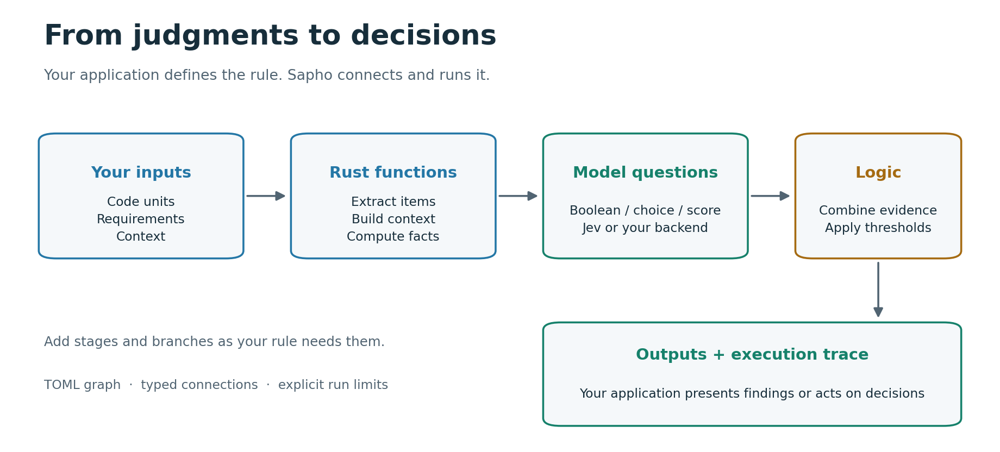
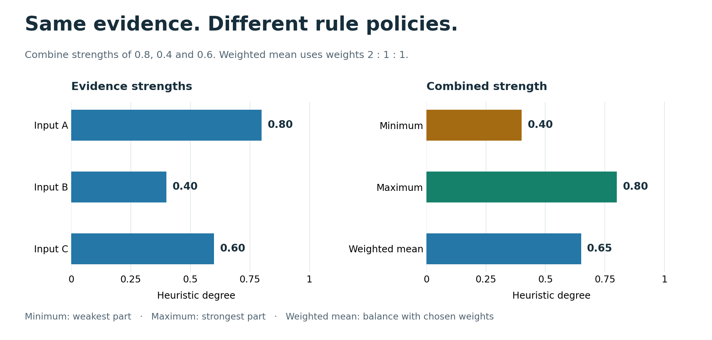
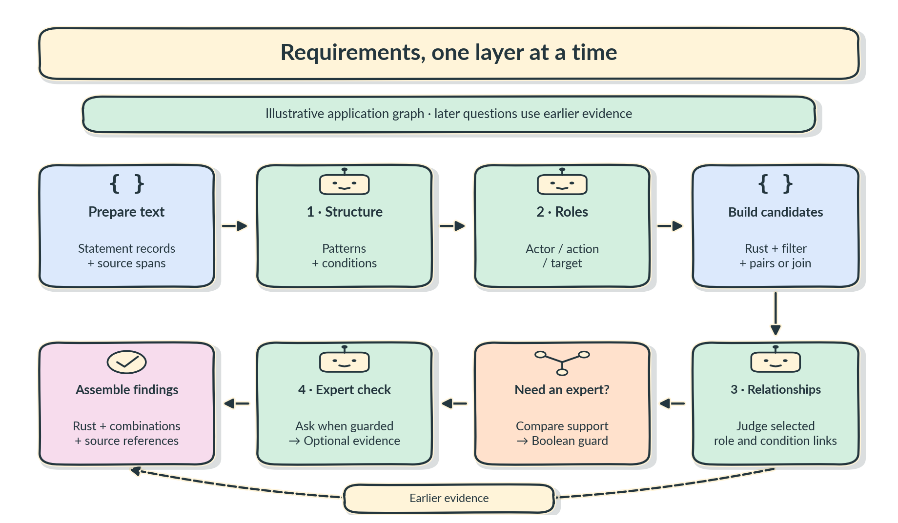

<div align="center">
  
</div>

# Sapho

[](https://discord.gg/6qsdhSPE)

**Make compound decisions with System One models and rules you write.**

Sapho is a Rust library and command-line tool for making compound decisions with
System One models such as Jev. System One models cut inference time and cost
significantly, and they are fast enough to run on an M5 laptop.

Sapho splits a decision into many simple questions, asks the model each one, and
combines the answers using rules you write. Rules use logic operators such as
and, or, min and max, and you can build larger rules out of smaller ones.

Write your questions and rules in YAML or JSON. Run them from the command line,
or use Sapho in a Rust application. Keep the answers and intermediate results
so you can see how a decision was made, measure it against labelled examples,
and improve the rule.

[CLI setup](#install-the-cli) · [Rust integration](#use-sapho-in-a-rust-project) ·
[Claude Code](#use-the-skills-in-claude-code) · [User guide](docs/user-guide.md)

## How it works

Suppose you want to decide whether a code change needs closer review. Break that
decision into questions:

- Did the public API change?
- Could the change break an existing contract?
- Are important cases missing from the tests?

Your code can answer the first question. A model can help answer the other two.
Then a rule combines those answers. For example, you could use this policy:

```text
needs_review = public_api_changed AND
               (contract_risk >= 0.7 OR test_gap >= 0.8)
```

You choose the questions, the meaning of each answer, and the thresholds.
Sapho runs the steps and returns the decision with a trace of the work that
produced it.



## Combine answers into rules

Some answers are yes or no. Others express how strongly a model supports an
answer. Sapho gives you operators for both:

| Operator | Use it when… |
|---|---|
| `and` | Every yes/no condition must hold. |
| `or` | Any one yes/no condition is enough. |
| `not` | You want to reverse a yes/no answer. |
| `min` | The weakest supporting part should limit the rule. |
| `max` | The strongest supporting part should determine the rule. |
| `weighted_mean` | Several answers contribute, with weights you choose. |
| `complement` | You want to reverse a strength: `1 − strength`. |
| `compare` | A score must cross a threshold to produce a yes/no decision. |

For strengths of **0.8, 0.4 and 0.6**, `min` gives **0.4**, `max` gives **0.8**,
and a weighted mean with weights **2, 1 and 1** gives **0.65**.



A combined strength is a heuristic score between zero and one. The combination
expresses your policy; a threshold turns the score into a decision. For example,
`strength < 0.7` could mean "send this item for review."

Rules can contain other rules. Combine the required parts of a statement with
`min`, combine acceptable alternatives with `max`, then apply a threshold to
the result. The [logic guide](docs/user-guide.md#combine-logic-and-evidence)
explains the operators and their input types.

## Build decisions in layers

An answer can help prepare the next question. For a requirement, you might first
ask what kind of statement it is, then identify its actor, action and target,
then ask how it relates to other requirements.



Each layer can use model questions, Rust functions, or smaller rules. Checks can
branch and combine again. Earlier answers can decide whether a later check is
needed, and different layers can use different registered model backends.

| Use case | A possible decision flow |
|---|---|
| Code review | Extract changed code → check facts and ask risk questions → combine the answers → flag changes for review. |
| Requirements | Classify statements → identify actors, actions and targets → prepare candidate links → judge relationships → produce findings. |
| A larger policy | Evaluate smaller rules → combine required parts and alternatives → decide whether the overall policy holds. |

You define the domain rules and extraction functions. Sapho connects and runs
them. See the [worked examples](docs/user-guide.md#worked-composition-examples)
for several ways to build these decisions.

## What Sapho gives you

- **Questions and rules in configuration.** Change questions, combinations and
  thresholds in YAML or JSON. Ask Boolean, choice or ordinal-score questions.
- **Models and code in the same decision.** Use Jev through the included adapter,
  or register your own Rust functions and backend for local Laya, KEV or other models.
- **Rules for collections.** Apply a rule to each item, filter results, compare
  candidate pairs and join related records.
- **Input gathering.** Select files, Git changes or parts of a JSON document,
  with item identities and source references carried into the evaluation.
- **Evidence and improvement tools.** Record model answers, replay them offline,
  measure agreement with supplied labels, compare rule candidates and export
  development examples for a downstream trainer.
- **Checks before execution and limits during it.** Catch invalid graph
  connections and types before evaluation. Set limits for model calls, items,
  concurrency, data and time.

## Install the CLI

You need Rust 1.98 or later and access to this repository. The checkout pins
Rust 1.98.1.

```sh
git clone https://github.com/agent-ix/sapho.git
cd sapho
cargo install --path crates/sapho-cli --locked
```

Try the included combination rule. It uses supplied scores and makes no model
calls:

```sh
sapho validate examples/graphs/combine.yaml
sapho run examples/graphs/combine.yaml --input examples/data/combine-input.json
```

The JSON report contains a `strength` output of **0.65** and a `needs_review`
output of **true**. The rule combines three strengths with weights 2, 1 and 1,
then asks for review when the result is below 0.7.

## Write your first rule

Here is a complete rule that asks for review when support is below 0.8.
Save it as `review.yaml`:

```yaml
inputs:
  support: {kind: probability}
nodes:
  - id: review
    operation: {kind: compare, comparator: less}
    inputs:
      a: {kind: input, name: support}
      b:
        kind: literal
        value: {id: cutoff, value: {kind: probability, value: 0.8}}
        value_type: {kind: probability}
outputs:
  needs_review: {kind: node, node: review, port: result}
```

Run it with a supplied answer:

```sh
printf '%s' '{"support":0.7}' | sapho run review.yaml
```

The `needs_review` output is **true**. Change support to 0.9 and it becomes
**false**. At exactly 0.8 it is also false because the rule uses `less`.
This example keeps the input simple; a model question can produce the support
value in a larger graph.

To use the decision in a shell or CI job, add `--fail-on needs_review`:

```sh
printf '%s' '{"support":0.7}' | sapho run review.yaml --fail-on needs_review
```

That command exits **1** when review is needed and **0** otherwise.
Configuration or execution failures exit **2**. JSON reports go to stdout;
diagnostics go to stderr.

## Use the CLI in a workflow

| Command | What it does |
|---|---|
| `sapho validate GRAPH` | Check a rule graph before running it. |
| `sapho inspect GRAPH` | Show its inputs, outputs, stages and required backends. |
| `sapho run GRAPH` | Evaluate inputs and return outputs with a trace. |
| `sapho select files`, `git` or `json` | Gather input for a matching graph. |
| `sapho record GRAPH` | Run a graph and save model exchanges. |
| `sapho replay GRAPH` | Run offline with saved model exchanges. |
| `sapho measure GRAPH` | Compare outputs with supplied labelled examples. |
| `sapho tune` | Compare candidate graphs using development examples. |
| `sapho export-training` | Export labelled development cases as JSONL. |

For example, gather Rust files or staged Git changes and pass them into the
included file-context graph:

```sh
sapho select files --root ./src --include '**/*.rs' |
  sapho run examples/graphs/files.yaml --typed-input

sapho select git --root . --mode staged |
  sapho run examples/graphs/files.yaml --typed-input
```

The example returns the selected files as context. Add your own questions and
rules to turn that context into findings. A review application can invoke the
graph for a PR, after an edit, or whenever its inputs change.

Measure the included tutorial rule and compare two threshold candidates:

```sh
sapho measure examples/graphs/review.yaml \
  --dataset examples/data/review-dataset.json --split development

sapho tune \
  --candidate examples/graphs/review.yaml \
  --candidate examples/graphs/review-conservative.yaml \
  --dataset examples/data/review-dataset.json \
  --output-name needs_review --metric agreement

sapho export-training --dataset examples/data/review-dataset.json \
  --output development.jsonl
```

Supply labels for the decisions you want to measure. `tune` compares the
candidates you provide on the development split; evaluate the chosen rule
separately on held-out examples. The included dataset is synthetic tutorial
data. The [CLI guide](docs/cli-guide.md) covers recording, exact replay, JSON
selection, training export and execution limits.

### Ask Jev from the CLI

Install with Jev support when you want model calls:

```sh
cargo install --path crates/sapho-cli --locked --features jev
```

Model graphs refer to a backend by name. For the included two-layer graph,
save this as `bindings.yaml`:

```yaml
judge:
  provider: jev
  model: jev-latest
  distribution_policy: {kind: strict}
```

Configure `TYPESAFE_API_KEY` in your environment, then run:

```sh
printf '%s' '{"text":"The controller shall illuminate the warning lamp."}' |
  sapho run examples/graphs/multilayer.yaml --bindings bindings.yaml
```

This example makes two model calls, passing the first answer into the second
layer's context. Replace its demonstration question with the questions your
rule needs. Keep credentials in the environment or the shared OS credential store; bindings describe the backend,
model and answer policy. See [Jev setup](docs/user-guide.md#connect-jev) for the
available settings and [model questions](docs/user-guide.md#ask-model-questions)
for a complete question-based rule.

To keep a run's answers and replay them later, save the input and record the run:

```sh
printf '%s' '{"text":"The controller shall illuminate the warning lamp."}' > input.json
sapho record examples/graphs/multilayer.yaml --input input.json \
  --bindings bindings.yaml --recording saved.json --trace trace.json
sapho replay examples/graphs/multilayer.yaml --input input.json --recording saved.json
```

Recording makes the model calls; replay uses their saved answers offline.
Replay matches the model, answer policy, input context and questions exactly.
You can change a threshold and reuse the answers when those requests stay the
same. Choose fresh recording and trace paths for each capture.

For an existing CLM service, install with `--features clm`, choose `provider: clm`
and `model: clm-latest` in the same bindings document, and set `CLM_BASE_URL` on
its host. Sapho sends typed questions to that service without installing models.
[CLM setup](docs/cli-guide.md#bind-clm-explicitly) explains authentication, limits
and the confidence/usage semantics. Rust hosts enable `clm` and construct
[`sapho::clm::ClmBackend`](docs/user-guide.md#connect-clm). Offline replay works
without credentials or a running provider.

## Use Sapho in a Rust project

Use the library when your application needs custom extraction, Rust functions
or model backends. The stock CLI runs graphs using data operations and its
configured Jev or CLM adapter; your registered Rust functions belong in an application
host.

Add these dependencies to your application's `Cargo.toml`:

```toml
[dependencies]
sapho = { git = "https://github.com/agent-ix/sapho.git" }
tokio = { version = "1", features = ["macros", "rt-multi-thread"] }
```

For local development, use `sapho = { path = "../sapho" }` instead, adjusting
the path to your checkout. Add `features = ["jev"]` to the Sapho dependency
when you need the included Jev adapter.

Put the `review.yaml` rule above at your application's root and this code in
`src/main.rs`:

```rust
//! A minimal Sapho decision in a Rust application.

use sapho::{
    core::{BackendRegistry, Datum, PrimitiveRegistry, Probability, Value},
    graph::{GraphSpec, compile},
    runtime::{Engine, RunLimits},
};
use std::collections::BTreeMap;

#[tokio::main]
async fn main() -> Result<(), Box<dyn std::error::Error>> {
    let spec = GraphSpec::parse(include_str!("../review.yaml"))?;
    let graph = compile(&spec, &PrimitiveRegistry::default())?;
    let engine = Engine::new(graph, BackendRegistry::default())?;
    let inputs = BTreeMap::from([(
        "support".into(),
        Datum::new("statement-1", Value::Probability(Probability::new(0.7)?))?,
    )]);

    let run = engine.run(&inputs, RunLimits::default()).await?;
    for (name, datum) in &run.outputs {
        println!("{name}: {:?}", datum.value);
    }
    Ok(())
}
```

Run `cargo run`. It prints `needs_review: Boolean(true)` without calling a model.
For a model-based rule, register its backends before constructing the engine.
For custom Rust steps, register functions before compiling the graph.

The [Rust user guide](docs/user-guide.md) walks through
[Jev integration](docs/user-guide.md#connect-jev),
[Rust functions](docs/user-guide.md#extend-the-graph-with-rust),
[other model backends](docs/user-guide.md#use-another-model-backend),
and [multi-stage evaluations](docs/user-guide.md#build-multi-stage-evaluations).

## Use the skills in Claude Code

The bundled [Sapho plugin](plugins/sapho/plugin.json) provides three skills:

| Skill | What it helps you do |
|---|---|
| `/sapho:create` | Turn a decision into questions and rules, then build and validate a graph. |
| `/sapho:tune` | Measure a graph and compare candidates against development labels. |
| `/sapho:record` | Save evaluation evidence and check exact offline replay. |

Install the Sapho CLI first. From the Sapho checkout, start Claude Code with:

```sh
claude --plugin-dir ./plugins/sapho
```

When working in another project, pass the absolute path to that same plugin
directory. This loads the skills for that session; include `--plugin-dir` when
starting a new session. See Claude Code's
[local plugin loading instructions](https://code.claude.com/docs/en/plugins/create#load-a-plugin-for-one-session).

For example, ask Claude:

```text
/sapho:create Build a rule that checks whether a requirement names an actor,
an observable action and a target. Combine the three strengths with min and
flag statements below 0.8. Include an input example and validate the graph.
```

The skills use the same CLI and graphs as your application. Model calls need
the backend configuration described above.

## Guides and reference

- [CLI guide](docs/cli-guide.md): commands, input gathering, model bindings,
  recording, replay, measurement, tuning and training export.
- [Rust user guide](docs/user-guide.md): complete examples, question types,
  logic, Rust extensions, model adapters and integration choices.
- [Behavior specifications](spec/spec.md): the contracts for values, graphs,
  execution, logic, evidence and extensions. Use these when implementing an
  adapter or checking a boundary condition.

Generate local API documentation with `cargo doc --no-deps --open`.
Add `--features jev` to include the Jev adapter.

## License and contributions

Sapho is licensed under [AGPL-3.0-or-later](LICENSE). Read
[CONTRIBUTING.md](CONTRIBUTING.md), [content rights](CONTENT_RIGHTS.md) and the
[CLA](CLA.md) before contributing. Join us on [Discord](https://discord.gg/6qsdhSPE).

The name comes from the juice Mentats drink to aid their mental calculations.
