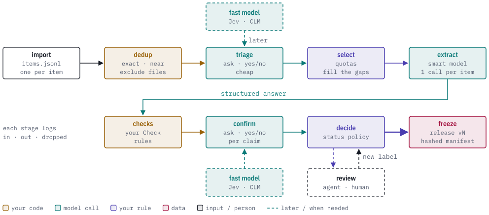
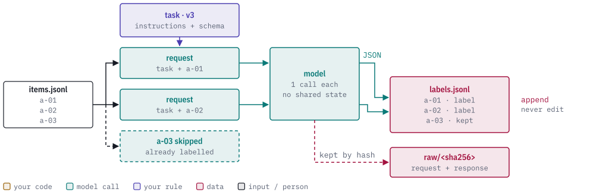
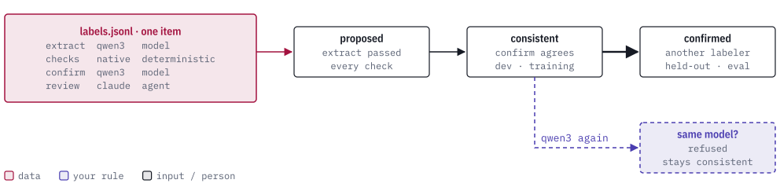

# Build a dataset with local models

[Documentation index](index.md) · [How Sapho works](how-it-works.md) · [Improve a rule](improve-a-rule.md)

**Status: design.** Nothing on this page is implemented yet. It describes the
planned `sapho-dataset` and `sapho-ollama` crates and the `sapho dataset`
commands, tracked in the Sapho Datasets project. The behavior specification
comes first; the commands below are the intended interface.

[Improve a rule](improve-a-rule.md) starts from cases whose right answer you
already know. This page covers the step before that: getting those labels. A
local model reads each item and labels it, your code checks the answer, a
second question confirms it, and every label keeps a record of who made it.
The result is a frozen, labelled release that `sapho measure`, `sapho tune`
and `sapho export-training` can use.

<picture>
  <source media="(prefers-color-scheme: dark)" srcset="images/dataset-funnel-dark.svg">
  
</picture>

## One primitive: batch map

Every stage that asks a model works the same way. For each item, Sapho builds
one request from the task's instructions and that item, sends it, and appends
the answer as one line. Nothing carries over between items: no chat history,
no earlier answers, no other item. The model gets the same small, complete
question every time, so the context limit is about one item rather than a
whole run.

<picture>
  <source media="(prefers-color-scheme: dark)" srcset="images/batch-map-dark.svg">
  
</picture>

A run is one task with one labeler over a set of items, one request at a time.
It stops after `--limit` items or `--max-minutes`, and running it again
continues where it stopped: items this task version and labeler have already
labelled are skipped. The exact request and response bodies are kept by hash
in `raw/`, so any label can be traced to what the model was actually sent and
what it actually said.

Prompt size is counted in tokens. Sapho estimates the size before sending and
compares it with the token count the model service reports after the call. An
item that does not fit is recorded with the outcome `too_large` and the run
moves on.

## Two kinds of task

| Kind | What the model returns | Who can answer |
|---|---|---|
| `ask` | Sapho question answers: yes/no, pick one, or a score | any model, including fast System One models such as Jev and CLM |
| `extract` | one structured record that matches a JSON Schema | a smart model, such as a local Qwen3 or a hosted model |

`ask` tasks are ordinary Sapho question graphs, so everything in
[How Sapho works](how-it-works.md) applies to them. All of an item's questions
go in one request. `extract` tasks are for answers too rich for a fixed set of
labels, such as "which words are the actions in this sentence". The schema
asks for evidence as quoted text, and your code finds the quotes, because
models copy text well and count characters badly.

## Every label says who made it

Labels are only ever appended to `labels.jsonl`, never edited. Each one
records its kind (`model`, `agent`, `human` or `deterministic_check`), the
labeler (which model, or which person), and the version of the task that
produced it. One item can have several labels for the same question; a
correction is simply a newer label. Decide reads all of them and gives the
item a status:

<picture>
  <source media="(prefers-color-scheme: dark)" srcset="images/label-status-dark.svg">
  
</picture>

| Status | Reached when | Good for |
|---|---|---|
| proposed | the extract answer passed every check | nothing yet |
| consistent | a confirming `ask` agreed with every claim | development and training |
| confirmed | a different labeler agreed | held-out evaluation |

A model never confirms its own labels. The same model asked a second question
can make an item consistent, never confirmed; confirmation takes a different
model, an agent or a person.

## The stages

A pipeline is an ordered list of stages in `project.yaml`. Each stage reads
the items that passed the stages before it, and records how many came in,
went out and were dropped. It also keeps a seeded sample of the items it
dropped, so a wrong drop can be found and measured later.

| Stage | Does | Typical labeler |
|---|---|---|
| dedup | drops exact, normalized and near-duplicate items; items to keep out are passed as `--exclude` files | code, embeddings |
| triage | cheap `ask` that sorts items before the expensive step | smart model now, fast model later |
| select | picks items to fill per-category quotas | your rule |
| extract | one structured answer per item | smart model |
| checks | your `Check` implementations: rules a model should not be trusted with | your code |
| confirm | `ask` with one yes/no question per claim in the extract answer | smart model now, fast model later |
| decide | gives each item a status from all its labels | your rule |
| review | items decide could not settle, answered by an agent or a person | agent, human |
| freeze | writes an immutable, content-hashed release with its splits | — |

Cheap stages come first so the expensive call only sees items worth paying
for. `sapho dataset measure` compares any labeler with a reference set, field
by field, along with its cost in tokens and seconds per item. That is how a
prompt change, a different model or a new stage earns its place.

## Fast models later

Triage and confirm are `ask` stages, and any System One model can answer an
`ask`. A fast model starts as a shadow next to the smart model: both answer,
only the smart model's answer counts, and `measure` compares them. Once its
agreement and its rate of wrong drops are good enough, it becomes a prefilter
that decides which items reach the slower model.

## A project on disk

```
my-dataset/
  project.yaml      # labelers, tasks, stages, quotas, decide policy
  items.jsonl       # one item per line: id, text, context, source, meta
  labels.jsonl      # every label from every labeler, append-only
  raw/<sha256>      # exact request and response bodies
  review/           # items waiting for review, and the answers coming back
  releases/v1/      # frozen release and its manifest
```

Every file is plain JSON or JSONL, so a person or an agent can open any stage's
input and output directly. Data lives here, outside the code repository.

## Planned commands

```sh
sapho dataset init my-dataset
sapho dataset import my-dataset items.jsonl
sapho dataset run my-dataset --stage extract --labeler ollama:qwen3:30b --limit 50
sapho dataset status my-dataset --json
sapho dataset review my-dataset --export review/out.jsonl
sapho dataset measure my-dataset --labeler ollama:qwen3:30b --reference reference.jsonl
sapho dataset freeze my-dataset --release v1
```

`status --json` is the one contract dashboards read: stage counts, failures by
reason, quota fill and throughput.
