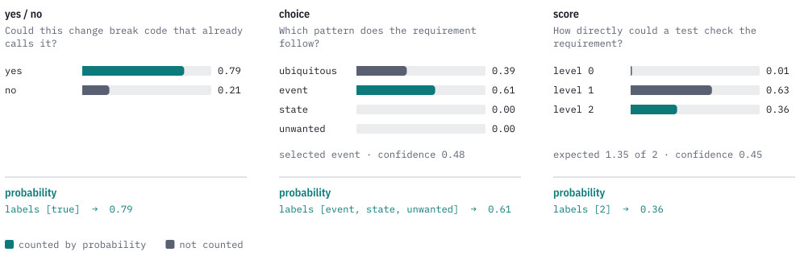
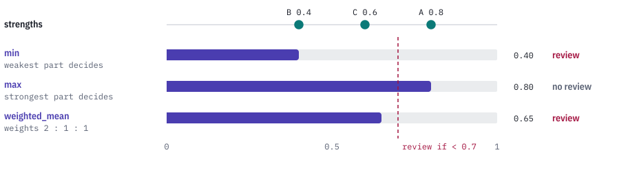
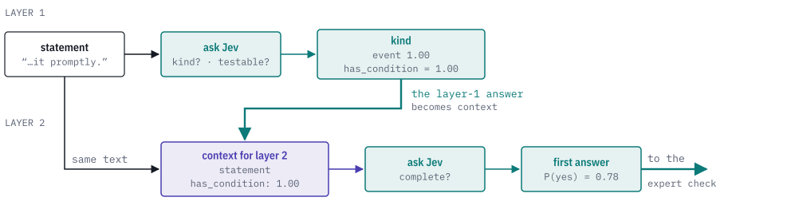
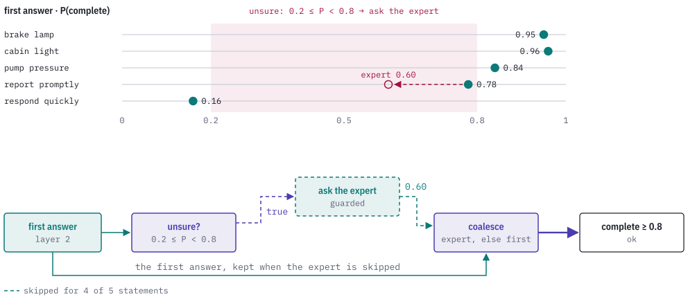
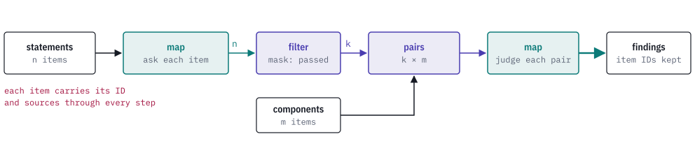

# How Sapho works

[Documentation index](index.md) · [Improve a rule](improve-a-rule.md) · [Graph reference](graph-reference.md)

A Sapho rule is a small graph. Some nodes ask a model questions, some take
facts from your code, and the rest are logic you write in YAML or JSON. This
page builds the idea from one decision, then adds layers, guards and
collections.

Every model answer on this page is a real answer from Jev, saved in
[`examples/recordings/`](../examples/recordings/). You can replay each example
offline with the commands shown, with no key and no network.

## A decision is a graph

Here is the README's code-review rule running on one change, a default
timeout shortened from 30 to 5 seconds:

<picture>
  <source media="(prefers-color-scheme: dark)" srcset="images/how-it-works-dark.svg">
  
</picture>

The graph is [`examples/graphs/code-review.yaml`](../examples/graphs/code-review.yaml).
Each node does one job:

| Node | What it does | In this rule |
|---|---|---|
| `record` | Builds the context the model sees. | The change text. |
| `questions` | Defines the questions and their allowed answers. | `contract_risk`, `test_gap`. |
| `ask` | Sends one context and one batch of questions to a model backend. | One request to Jev. |
| `probability` | Reads the probability of the labels you choose from the answers. | 0.79 and 0.61. |
| `compare` | Turns a number into true or false against a threshold. | `≥ 0.7`, `≥ 0.8`. |
| `and`, `or`, `not` | Combines true/false values. | `or`, then `and`. |

`public_api_changed` is a graph input. Your code computes it, for example with
a public-API diff in CI, and passes it in with the change. The model never
sees it. This rule asks Jev even when the fact is false; a
[guard](#ask-the-expensive-question-only-when-needed) on the `ask` node would
skip that call.

The model part of the graph looks like this:

```yaml
- id: questions
  operation:
    kind: questions
    questions:
      - id: contract_risk
        question:
          kind: boolean
          instructions: Could this change break code that already calls it?
          yes: An existing caller could break or behave differently.
          no: Existing callers keep working as before.
      - id: test_gap
        question:
          kind: boolean
          instructions: Does the change add behavior that its tests do not exercise?
          yes: Some new behavior has no test.
          no: The tests exercise the new behavior.
- id: ask
  operation: {kind: ask, backend: judge}
  inputs:
    state: {kind: node, node: context, port: result}
    questions: {kind: node, node: questions, port: result}
- id: contract_risk
  operation: {kind: probability, question: contract_risk, labels: ["true"]}
  inputs: {answers: {kind: node, node: ask, port: answers}}
```

`backend: judge` is a name. The graph does not say which model answers; a
bindings file maps `judge` to Jev, CLM or your own backend at run time.

Before anything runs, Sapho compiles the graph. Every connection must carry
the type its consumer expects, every name must resolve, and the graph must
have no cycles. `sapho inspect` prints the result as JSON: the inputs and
outputs with their types, the backend names to bind, and the order of work.
Its `stages` for this graph:

```sh
sapho inspect examples/graphs/code-review.yaml | jq -c '.groups[0].stages'
```

```json
[["context","questions"],["ask"],["contract_risk","test_gap"],["risky_contract","untested"],["either"],["needs_review"]]
```

Nodes in the same stage do not depend on each other. Independent model calls
in a stage can run at the same time, up to the concurrency limit.

Replay the run in the figure:

```sh
sapho replay examples/graphs/code-review.yaml \
  --input examples/data/code-review-input.json \
  --recording examples/recordings/code-review.json
```

## What a model answer is

A System One model such as Jev does not write an explanation. Each question
comes with a fixed set of possible answers, and the model returns how likely
each one is. That is why answers are fast, cheap and easy to combine: they
are numbers, not text to parse.

<picture>
  <source media="(prefers-color-scheme: dark)" srcset="images/model-answers-dark.svg">
  
</picture>

Sapho has three kinds of question:

| Question | You define | The model returns |
|---|---|---|
| Yes/no (`boolean`) | `instructions`, the meaning of `yes` and `no` | P(yes) |
| Choice (`choice`) | `instructions` and labelled `options` | A probability per option, the option it would pick and a confidence |
| Score (`score`) | `instructions` and ordered `levels` | A probability per level, the expected score and a confidence |

The `probability` node adds up the probabilities of the labels you list. In
the choice example, the statement "The system shall respond quickly to user
requests" has a condition if its pattern is event, state or unwanted, so the
rule counts those three: 0.61 + 0 + 0 = 0.61. Jev was split between *event*
and *ubiquitous* on this statement, and the numbers show it.

These numbers mean different things, and Sapho keeps them apart:

- **Probability** is how likely the model thinks an answer is.
- **Confidence** is the model's own report on its pick or score. It is kept
  in the answer but is not a probability.
- **Expected score** is the average level, weighted by probability: 1.35 here.
- **Degree** is a strength you combine with your own policy (next section).
  It is a heuristic, not a probability.

A probability the model did not supply is an error, not zero. Each backend
binding sets a distribution policy for answers that list every label:
`strict` accepts them only when their probabilities add up to one, and
`approximate` accepts totals within a bound you set, at most 0.05, and rescales
what `probability` reads. The raw answer is kept either way. Answers that list
only some labels are never rescaled.

## Combine strengths with your rule

Some decisions weigh several pieces of evidence. Convert each probability or
number to a Degree with the `degree` node, then combine a list of degrees with
a `reduce` node. Its `reducer` sets the policy, and `empty` sets the result for
an empty list:

| `reducer` | Use it when |
|---|---|
| `min` | Every part is required; the weakest part limits the result. |
| `max` | Any one of several alternatives is enough. |
| `weighted_mean` | Several parts contribute, with weights you choose. |

```yaml
- id: strength
  operation: {kind: reduce, reducer: weighted_mean, empty: 0.0}
  inputs:
    values: {kind: node, node: degrees, port: result}
    weights: {kind: node, node: weights, port: result}
```

A separate `complement` node gives the opposite strength, `1 − x`.

The same three strengths give different results under different policies:

<picture>
  <source media="(prefers-color-scheme: dark)" srcset="images/combine-strengths-dark.svg">
  
</picture>

Picking the combination is picking the policy. `compare` then turns the
combined strength into a decision. Run the weighted-mean version with
supplied strengths, no model needed:

```sh
sapho run examples/graphs/combine.yaml --input examples/data/combine-input.json
```

Its `strength` output is 0.65 and `needs_review` is true.

Rules can contain rules. To require an actor, an action and a target, take
the `min` of those three. To accept either of two sentence patterns, take the
`max` of those two. Then take the `min` of both results and compare it with
a threshold. The [strengths example](../examples/reference/strengths.yaml)
shows every reducer and the empty-list default.

## Ask in layers

An answer can become part of the next question's context. This rule checks a
requirement in two layers. Layer 1 asks which pattern the requirement follows.
The layer-1 answer goes into the context for layer 2, next to the same
statement:

<picture>
  <source media="(prefers-color-scheme: dark)" srcset="images/layers-dark.svg">
  
</picture>

The link between the layers is an ordinary `record` node:

```yaml
- id: context2
  operation: {kind: record}
  inputs:
    statement: {kind: input, name: statement}
    has_condition: {kind: node, node: conditional, port: result}
```

Because `context2` reads `conditional`, the layer-2 `ask` waits for layer 1.
The dependency edges set the order; you never schedule anything yourself.
Different layers can use different backends, and a Rust function can build
the next context or even the next questions from earlier answers.

## Ask the expensive question only when needed

A guard makes a node conditional. When the guard is false, the node is
skipped: no model call, and its output is absent. `coalesce` turns an absent
value into a default you choose.

The [requirement check](../examples/graphs/requirement-check.yaml) asks an
expert only when layer 2 is unsure, meaning its answer falls between 0.2 and
0.8. For the five recorded statements, that happened once:

<picture>
  <source media="(prefers-color-scheme: dark)" srcset="images/guard-dark.svg">
  
</picture>

```yaml
- id: expert
  guard: {kind: node, node: unsure, port: result}
  operation: {kind: ask, backend: expert}
  inputs:
    state: {kind: node, node: context2, port: result}
    questions: {kind: node, node: expert_questions, port: result}
- id: answers
  operation: {kind: coalesce}
  inputs:
    value: {kind: node, node: expert, port: answers}
    default: {kind: node, node: layer2, port: answers}
```

The expert's question uses the same id, `complete`, so one `probability` node
reads the final answer from whichever answers `coalesce` returns. In the
recording, `expert` is the same Jev model asked a more detailed question. In
practice you would bind it to a larger model or a service that costs more per
call.

Replay the statement that reached the expert, then one that did not:

```sh
sapho replay examples/graphs/requirement-check.yaml \
  --input examples/data/requirements/report.json \
  --recording examples/recordings/requirement-check.json

sapho replay examples/graphs/requirement-check.yaml \
  --input examples/data/requirements/brake-lamp.json \
  --recording examples/recordings/requirement-check.json
```

The first reports `asked_expert` true, `first_answer` 0.78 and `complete`
0.6. The second reports `asked_expert` false, and its trace shows the
`expert` node as `skipped`.

## Apply a rule to many items

Collections let one graph handle many items: every changed file, every
requirement, every pair of related records.

<picture>
  <source media="(prefers-color-scheme: dark)" srcset="images/collections-dark.svg">
  
</picture>

| Operation | What it does |
|---|---|
| `map` | Runs a named subgraph once per item, in order. |
| `filter` | Keeps the items whose true/false mask entry is true. |
| `pairs` | Forms every left/right pair of two lists. |
| `join` | Pairs records whose key fields match. |
| `collect` | Flattens a list of lists by one level. |

Filter before you pair when you can. `pairs` of k and m items makes k × m
candidates, and each one you judge is a model call; run limits apply across
every layer and mapped item.

Every item has an ID, and results carry the IDs and any source references of
the items they came from. When the inputs carry source references, as
`sapho select` output does, a finding can point back to the file, line or
statement that produced it. The [collections example](../examples/reference/collections.yaml)
runs each operation.

## What a run gives you

A run returns a JSON report with the graph's `outputs` and a `trace`. The
trace lists every node with its inputs, outputs and status: `completed`,
`skipped` or `failed`. A model node also keeps the exact request and
response. Here is the `ask` node from the first figure, trimmed:

```json
{
  "path": ["root", "ask"],
  "status": "completed",
  "model": {
    "request": {
      "backend": "judge",
      "model": "jev-1.13.0",
      "distribution_policy": {"kind": "strict"},
      "state": {"kind": "record", "value": {"change": {"kind": "text", "value": "--- a/src/config.rs …"}}},
      "questions": [{"id": "contract_risk", …}, {"id": "test_gap", …}]
    },
    "response": {
      "model": "jev-1.13.0",
      "answers": {
        "contract_risk": {"kind": "boolean", "probability": 0.79},
        "test_gap": {"kind": "boolean", "probability": 0.61}
      },
      "usage": {"input_tokens": 424, "output_tokens": 39}
    }
  }
}
```

The saved requests and responses are what make replay possible: a recording
is a list of these exchanges. Change a threshold or the logic after the
model, and the same requests come up again, so replay can answer them.
Change a question, the context or the model, and you need a new recording.

Every run is bounded. Model calls, executed nodes, collection items,
concurrency, data size and time all have limits; the CLI defaults are 128
model calls and 60 seconds per run. A run that exceeds a limit stops with a typed error. A
failed run still returns the trace up to the failure, so you can see where it
stopped.

## Next

- [Improve a rule](improve-a-rule.md): measure a rule against labelled cases
  and compare candidates, offline.
- [CLI guide](cli-guide.md): every command, bindings for Jev and CLM, and
  input gathering.
- [Rust user guide](user-guide.md): embed Sapho and register your own
  functions and model backends.
- [Graph reference](graph-reference.md): every operation, port and field.
