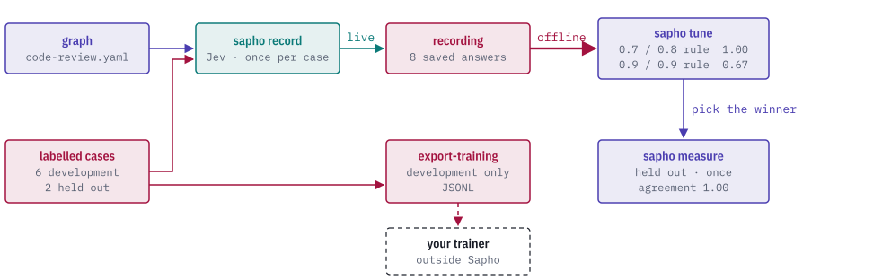

# Improve a rule

[Documentation index](index.md) · [How Sapho works](how-it-works.md) · [CLI guide](cli-guide.md)

A rule is only as good as its questions and thresholds. To know whether a
change makes it better, check it against cases where you already know the
right decision. Sapho records the model's answers once, then measures and
compares rules against those cases offline, so trying a new threshold costs
no model calls.

<picture>
  <source media="(prefers-color-scheme: dark)" srcset="images/evidence-loop-dark.svg">
  
</picture>

<details>
<summary>Show the whole diagram</summary>

<picture>
  <source media="(prefers-color-scheme: dark)" srcset="images/evidence-loop-still-dark.svg">
  
</picture>

</details>

Every command below runs from the checkout with the files in `examples/`. The
eight cases are small code changes written for this guide, and their labels
are synthetic tutorial labels: they show the workflow, not Jev's accuracy.

## 1. Label some cases

A dataset is a JSON file of cases. Each case has an ID, a split, the graph
inputs and the decisions you expect:

```json
{
  "id": "default-timeout",
  "split": "development",
  "inputs": {
    "change": {"id": "default-timeout", "value": {"kind": "text", "value": "--- a/src/config.rs …"}, "sources": []},
    "public_api_changed": {"id": "default-timeout", "value": {"kind": "boolean", "value": true}, "sources": []}
  },
  "labels": {"needs_review": true},
  "label_provenance": {"kind": "human", "source": "Sapho docs author", "reference": "Synthetic tutorial label written for the Sapho docs; no semantic accuracy claim"}
}
```

The split decides how a case may be used:

- **development** cases are for trying and comparing rules. Look at them as
  often as you like.
- **held_out** cases are for one final check of the rule you chose. If you
  tune against them, they stop telling you how the rule does on new cases.

[`code-review-dataset.json`](../examples/data/code-review-dataset.json) has
six development cases and two held out. `label_provenance` records where
each label came from: its kind (`human` here), its source and a reference.

## 2. Record the answers once

`sapho record` runs a graph on one input against a live model and saves every
successful exchange. It needs the `jev` feature, `TYPESAFE_API_KEY` and a
bindings file that maps the graph's `judge` backend to Jev:

```yaml
judge:
  provider: jev
  model: jev-1.13.0
  expected_model: jev-1.13.0
  distribution_policy: {kind: strict}
```

```sh
sapho record examples/graphs/code-review.yaml \
  --input examples/data/code-review-input.json \
  --bindings bindings.yaml --recording saved.json
```

[`examples/recordings/code-review.json`](../examples/recordings/code-review.json)
holds Jev's answers for all eight cases.
[`scripts/record-examples.sh`](../scripts/record-examples.sh) runs `record`
once per case and joins the exchanges into that one file. Everything after
this step runs offline.

`record` writes new files only: it refuses an existing `--recording`,
`--output` or `--trace` path, so choose fresh paths for each capture.

A fixed recording also makes comparisons fair. Jev's answers vary slightly
from run to run; when these cases were recorded a second time, some answers
moved by a few hundredths. Comparing two rules on the same recorded answers means any
difference comes from the rules.

## 3. Measure a rule

```sh
sapho measure examples/graphs/code-review.yaml \
  --dataset examples/data/code-review-dataset.json --split development \
  --replay examples/recordings/code-review.json
```

The report's `measurement` counts how each labelled output did:

```json
"needs_review": {
  "labelled": 6, "scored": 6, "unscored": 0, "failed": 0,
  "metrics": {
    "kind": "boolean",
    "confusion": {"true_positive": 3, "true_negative": 3, "false_positive": 0, "false_negative": 0},
    "agreement": 1.0
  }
}
```

`predictions` lists each case with its label and the rule's answer, and
`runs` keeps each case's full report and trace. When a case is wrong, its
trace shows which answer or threshold caused it.

## 4. Compare candidate rules

[`code-review-relaxed.yaml`](../examples/graphs/code-review-relaxed.yaml) is
the same rule with both thresholds raised to 0.9. Compare the two on the
development cases:

```sh
sapho tune \
  --candidate examples/graphs/code-review.yaml \
  --candidate examples/graphs/code-review-relaxed.yaml \
  --dataset examples/data/code-review-dataset.json \
  --output-name needs_review --metric agreement \
  --replay examples/recordings/code-review.json
```

The `ranking` puts the original first, with agreement 1.00, and the relaxed
rule second with 0.67. The relaxed rule misses two changes that need review:
the shortened default timeout (contract risk 0.79) and the untested CSV
export (test gap 0.83). Both candidates ask Jev the same questions, so one
recording answers both.

`tune` only reads development cases, and it ranks only candidates that score
every one of them. Use `--metric brier` to rank a probability output against
true/false labels instead.

## 5. Check the chosen rule once on held-out cases

```sh
sapho measure examples/graphs/code-review.yaml \
  --dataset examples/data/code-review-dataset.json --split held_out \
  --replay examples/recordings/code-review.json
```

Both held-out cases agree. Look at the predictions anyway. For the change
that adds a variant to a public enum, Jev put contract risk at only 0.48.
The rule flagged it through the test-gap question (0.82). That is worth
knowing before you trust the contract question on its own.

## 6. Export development cases for training

```sh
sapho export-training --dataset examples/data/code-review-dataset.json \
  --output development.jsonl
```

Each line is one development case with its inputs, labels and provenance.
Held-out cases are never exported. Like `record`, `export-training` refuses to
overwrite an existing file. Sapho does not train models; the file is
for a trainer you run elsewhere.

## When you need a new recording

Replay answers a request only if it matches a recorded one exactly: the same
backend name, model, expected model, distribution policy, context and ordered
questions.

| You changed | Replay with the same recording? |
|---|---|
| A threshold, a combination or other logic after the model | Yes |
| A question's wording, its answer options or their order | No, record again |
| The context the model sees | No, record again |
| The backend name, the model, the expected model or the distribution policy | No, record again |

A request with no recorded match fails with a replay-miss error rather than
calling a live model.
