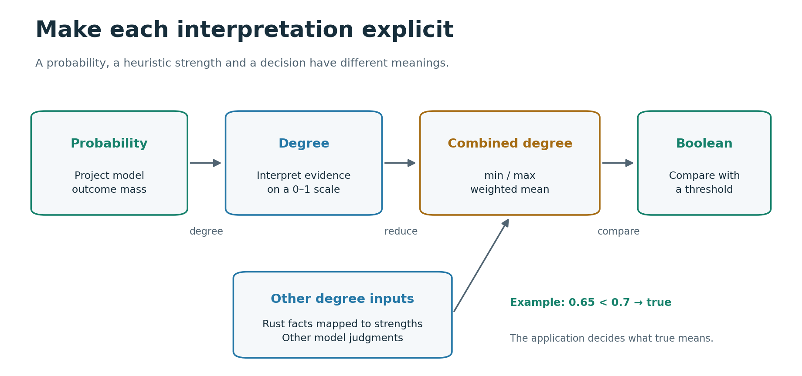
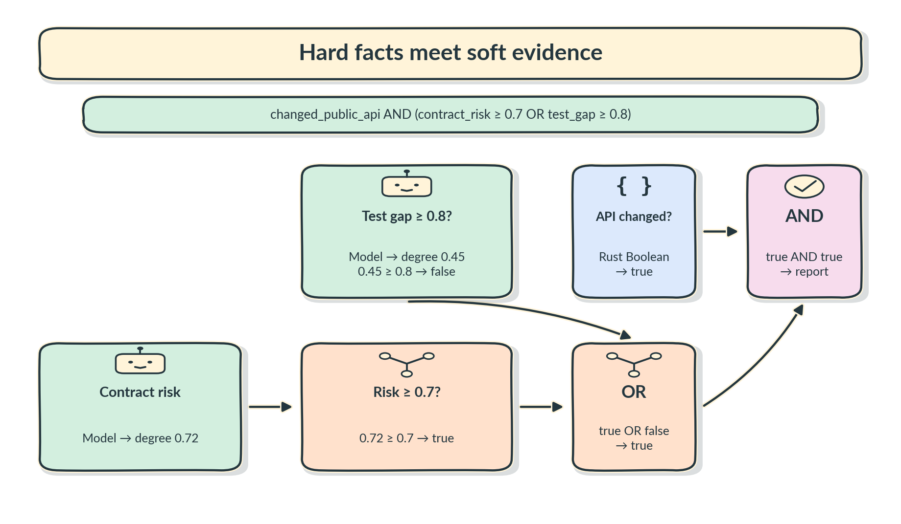
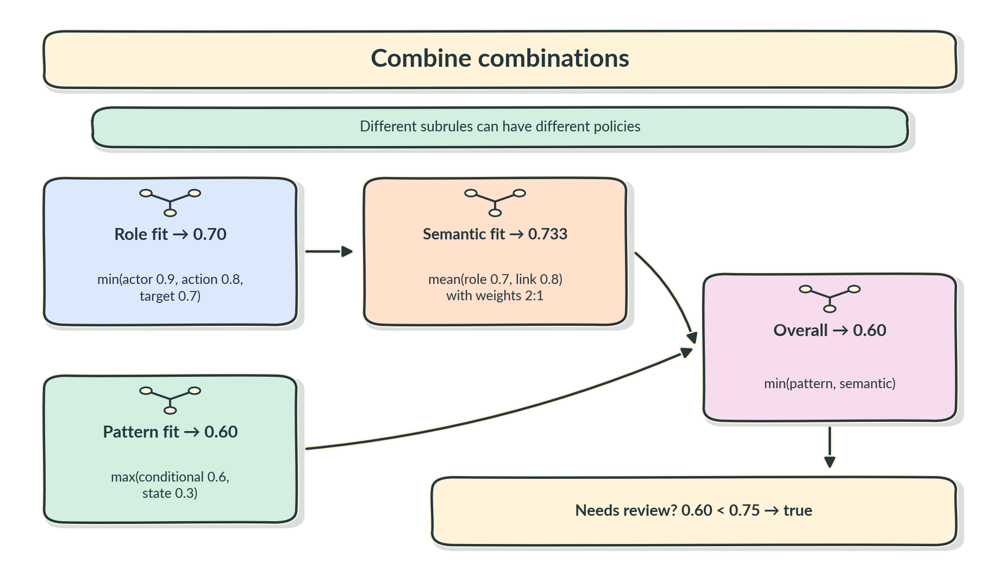

<!-- SPDX-License-Identifier: AGPL-3.0-or-later -->
<!-- Copyright (C) 2026 Agent-IX -->

# Sapho user guide

Sapho evaluates a configured graph of Rust functions, model questions and logic.
You supply the domain: what counts as an item, what to ask, how answers combine
and what the final decision means. This guide takes you from an offline graph
to an evaluation embedded in your own application.

- [Install](#install)
- [Run your first graph](#run-your-first-graph)
- [Ask model questions](#ask-model-questions)
- [Connect Jev](#connect-jev)
- [Connect CLM](#connect-clm)
- [Combine logic and evidence](#combine-logic-and-evidence)
- [Extend the graph with Rust](#extend-the-graph-with-rust)
- [Build multi-stage evaluations](#build-multi-stage-evaluations)
- [Worked composition examples](#worked-composition-examples)
- [Preserve identity and source references](#preserve-identity-and-source-references)
- [Set execution limits](#set-execution-limits)
- [Inspect outputs and failures](#inspect-outputs-and-failures)
- [Record and replay model calls](#record-and-replay-model-calls)
- [Use another model backend](#use-another-model-backend)
- [Choose your dependencies](#choose-your-dependencies)
- [Operation reference](#operation-reference)
- [Behavior contracts and contributing](#behavior-contracts-and-contributing)

For a command-line workflow, start with the [CLI guide](cli-guide.md): validate, run, select files or Git changes, record/replay, measure and tune. This guide explains Rust embedding and the graph semantics shared by both hosts.

## Install

Use Rust 1.98 or later. Sapho's checkout pins Rust 1.98.1. In your application:

```toml
[dependencies]
sapho = { git = "https://github.com/agent-ix/sapho.git" }
tokio = { version = "1", features = ["macros", "rt-multi-thread"] }
```

The Git repository requires access. For local development, replace the Sapho
dependency with `sapho = { path = "../sapho" }`, adjusting the path to your
checkout. Use a Git `rev` and retain your application's `Cargo.lock` when you
want reproducible dependency selection. The default facade does not enable Jev.

## Run your first graph

Start with a supplied probability and a policy: send an item for review when
its support is **strictly below 0.8**. This example makes no model calls. It
shows the same parse, compile and run flow you use for larger graphs.

Save this as `review.yaml` at your application's root:

<!-- example: review.yaml -->
```yaml
inputs:
  support:
    kind: probability
nodes:
- id: review
  operation:
    kind: compare
    comparator: less
  inputs:
    a:
      kind: input
      name: support
    b:
      kind: literal
      value:
        id: cutoff
        value:
          kind: probability
          value: 0.8
      value_type:
        kind: probability
outputs:
  needs_review:
    kind: node
    node: review
    port: result
```

Replace `src/main.rs` with:

<!-- example: main.rs -->
```rust
use std::{collections::BTreeMap, time::Duration};
use sapho::{
    core::{BackendRegistry, Datum, PrimitiveRegistry, Probability, Value},
    graph::{GraphSpec, compile},
    runtime::{Engine, RunLimits},
};

#[tokio::main]
async fn main() -> Result<(), Box<dyn std::error::Error>> {
    let spec = GraphSpec::parse(include_str!("../review.yaml"))?;
    let graph = compile(&spec, &PrimitiveRegistry::default())?;
    let engine = Engine::new(graph, BackendRegistry::default())?;

    let inputs = BTreeMap::from([(
        "support".into(),
        Datum::new("statement-1", Value::Probability(Probability::new(0.73)?))?,
    )]);
    let limits = RunLimits {
        node_instances: 100,
        collection_items: 1_000,
        model_requests: 10,
        concurrency: 2,
        data_bytes: 1_000_000,
        duration: Duration::from_secs(30),
    };

    let run = engine.run(&inputs, limits).await?;
    for (name, datum) in &run.outputs {
        println!("{name}: {:?}", datum.value);
    }
    Ok(())
}
```

Run `cargo run`. The output is `needs_review: Boolean(true)` because 0.73 is
below 0.8. At exactly 0.8 it would be false. Use `less_equal` if equality
should also trigger review.

`GraphSpec::parse` loads constrained YAML. Use `GraphSpec::parse_with_format(text, GraphFormat::Json)` for generated JSON. Both encodings use the same schema; graph TOML is no longer accepted. `compile` checks port names, types,
references and cycles, and resolves registered Rust primitives. It executes
neither native functions nor inference. `Engine::new` checks backend bindings;
`run` evaluates the graph with the inputs and limits you provide.

Graph inputs and outputs are named maps of `Datum`. A datum has an item ID,
a typed `Value` and optional source references. `Probability::new` rejects
non-finite values and values outside zero to one. The `Box<dyn Error>` here is
only the example executable's error boundary; Sapho APIs return typed errors.

## Ask model questions

Now let a model produce the evidence. This complete graph asks whether text
states an observable action, projects P(true), and applies the same threshold.
Save it as `judge.yaml`:

<!-- example: judge.yaml -->
```yaml
inputs:
  state:
    kind: record
    fields:
      text:
        kind: text
nodes:
- id: questions
  operation:
    kind: questions
    questions:
    - id: observable
      question:
        kind: boolean
        instructions: Does the text specify an action whose occurrence can be observed?
        'yes': The action has an observable outcome.
        'no': The action has no observable outcome.
- id: judge
  operation:
    kind: ask
    backend: judge
  inputs:
    state:
      kind: input
      name: state
    questions:
      kind: node
      node: questions
      port: result
- id: support
  operation:
    kind: probability
    question: observable
    labels:
    - 'true'
  inputs:
    answers:
      kind: node
      node: judge
      port: answers
- id: review
  operation:
    kind: compare
    comparator: less
  inputs:
    a:
      kind: node
      node: support
      port: result
    b:
      kind: literal
      value:
        id: cutoff
        value:
          kind: probability
          value: 0.8
      value_type:
        kind: probability
outputs:
  needs_review:
    kind: node
    node: review
    port: result
  support:
    kind: node
    node: support
    port: result
```

In the first example's Rust program, load `judge.yaml`, register a backend
named `judge` as described below, and supply `state` instead of `support`:

<!-- example: state.rs -->
```rust
let inputs = BTreeMap::from([(
    "state".into(),
    Datum::new(
        "statement-1",
        Value::Record(BTreeMap::from([(
            "text".into(),
            Value::Text("The controller shall illuminate the warning lamp.".into()),
        )])),
    )?,
)]);
```

An `ask` receives one Record state and one ordered question batch. Its outputs
are `answers` and the actual `model` identity. Put related questions with the
same context in one batch. Separate `ask` nodes make separate requests; ready
independent requests can run concurrently up to the run limit.

### Choose the answer space

| Question | Configuration | Answer you receive | How to use it |
|---|---|---|---|
| Boolean | `instructions`, `yes`, `no` | P(true) | Project labels `true`, `false`, or both. |
| Choice | `instructions`, ordered `options` with `label` and `description` | Selected label, confidence and any supplied outcome probabilities | Project mass for one label or a set of labels. |
| Score | `instructions`, ordered `levels` | Expected ordinal score, confidence and any supplied level probabilities | Use level labels `0`, `1`, … for probability projection, or interpret the score in Rust. |

Choice and score questions need at least two alternatives. IDs must be unique
within a batch. Scores can be fractional: an expected score of 1.5 is valid
on a three-level rubric. A selected label's reported confidence is retained
separately from its outcome probability.

The `probability` operation sums the requested known outcome mass. Missing
probabilities cause `UnsupportedDistribution`; they do not become zero.
Returning a selected choice alone is insufficient for a probability-based
rule. Choose questions and backends that provide the evidence your graph uses.

## Connect Jev

Enable the optional adapter and add the SDK crates used to construct its client:

```toml
[dependencies]
sapho = { git = "https://github.com/agent-ix/sapho.git", features = ["jev"] }
tokio = { version = "1", features = ["macros", "rt-multi-thread"] }
typesafe-sdk-client = "=0.6.2"
typesafe-sdk-config = "=0.6.2"
typesafe-sdk-env = "=0.6.2"
typesafe-sdk-http = "=0.6.2"
```

This helper builds the `judge` registry used by `judge.yaml`. Call it from the
example's `main`, then pass its result to `Engine::new`:

<!-- example: jev.rs -->
```rust
use std::sync::Arc;
use sapho::{
    core::{BackendBinding, BackendId, BackendRegistry, DistributionPolicy},
    jev::JevBackend,
};
use typesafe_sdk_client::Client;
use typesafe_sdk_config::Builder;
use typesafe_sdk_env::Process;
use typesafe_sdk_http::Reqwest;

fn jev_backends() -> Result<BackendRegistry, Box<dyn std::error::Error>> {
    let config = Builder::new().build(&Process)?;
    let client = Client::with_transport(config, Arc::new(Reqwest::new()?));
    let mut backends = BackendRegistry::default();
    backends.register(
        BackendId::new("judge")?,
        BackendBinding {
            backend: Arc::new(JevBackend::new(client)),
            model: "jev-latest".into(),
            expected_model: None,
            distribution_policy: DistributionPolicy::Strict {},
        },
    )?;
    Ok(backends)
}
```

Replace the empty backend registry in the first example with:

```rust
let backends = jev_backends()?;
let engine = Engine::new(graph, backends)?;
```

Supply `TYPESAFE_API_KEY` through your application's environment or secret
manager. The SDK config builder reads the process environment; the host owns
endpoint and transport configuration. Credentials belong in the host, not the
graph. Set `model` to the provider identifier you want. Set `expected_model`
to `Some(actual_model_id)` when a changed actual model should fail the run.

Every binding requires an explicit distribution policy. `Strict {}` expects
complete probability mass within numerical roundoff. If you choose to accept
rounded complete distributions, use `DistributionPolicy::approximate(0.01)?`:
the bound is your maximum absolute mass error, must be positive and cannot
exceed 0.05. Raw answers remain unchanged; probability projections use a
separately derived normalization for accepted approximate complete mass.
Partial distributions are never normalized. Inspect
`Answers::distribution_state` and `distribution_adjustment` when auditing
that interpretation. Keep the same policy for replay.

One graph call is one attempt; the adapter disables SDK retries. Authentication,
rate limiting and provider validation refusals return structured errors. The
engine does not initiate repair or additional model calls for you.

## Connect CLM

Enable `clm` on the facade dependency and configure the host-managed service before evaluating a graph. The adapter does not download weights, start a server or resolve credentials itself. A host that needs credentials resolves them synchronously through ix-cli-kit and passes a `SecretValue` reference to construction.

```rust
use std::sync::Arc;
use sapho::{clm::{ClmBackend, Limits, DEFAULT_MODEL},
    core::{BackendBinding, BackendId, BackendRegistry, DistributionPolicy}};

fn clm_backends() -> sapho::core::Result<BackendRegistry> {
    let backend = ClmBackend::new("http://127.0.0.1:8700", None, Limits::default())
        .map_err(|_| sapho::core::SaphoError::new(
            sapho::core::ErrorCode::BackendFailed, "CLM configuration refused"))?;
    let mut backends = BackendRegistry::default();
    backends.register(BackendId::new("judge")?, BackendBinding {
        backend: Arc::new(backend), model: DEFAULT_MODEL.into(), expected_model: None,
        distribution_policy: DistributionPolicy::Strict {},
    })?;
    Ok(backends)
}
```

The host can reduce finite `Limits` and choose an HTTPS endpoint; HTTP is restricted to loopback. Headers, private request/response bodies and native transport errors are excluded from diagnostics. The adapter preserves CLM confidence (top probability minus mean of the rest), probability distributions, fractional expected scores and usage including `billing_units`. Core/runtime apply the binding's distribution policy without changing raw values. Rust code constructing `Usage` supplies `billing_units: None` when the provider reports only token counts. Jev does so; CLM reports question charges separately.

See [CLI CLM setup](cli-guide.md#bind-clm-explicitly) for environment/OS-store precedence and offline replay. Jev and CLM share one source-free request translator in `sapho-systemone`, consuming SDK-owned wire types; each adapter owns its transport and response boundary.

## Combine logic and evidence

Sapho distinguishes four things you may want to combine:

| Type | Meaning | Typical operation |
|---|---|---|
| `Boolean` | An explicit true/false fact or decision | `and`, `or`, `not` |
| `Probability` | A model's probability evidence for an outcome | `probability`, then `compare` or `degree` |
| `Degree` | Your heuristic strength on [0, 1] | `reduce`, `complement` |
| `Optional(T)` | A value that may be absent | `coalesce` |



Boolean `and` and `or` take two Boolean operands; `not` takes one. There is
no implicit probability-to-Boolean conversion. `compare` produces a Boolean
using `equal`, `less`, `less_equal`, `greater` or `greater_equal`. Both
operands must have the same scalar type. Ordering supports Number,
Probability and Degree; equality also supports Boolean and Text.

Use `degree` to explicitly interpret a Probability or a Number on [0, 1] as
a heuristic strength. This conversion does not calibrate a model. If an
ordinal score ranges from zero to four, your Rust primitive must first
apply the domain's chosen mapping into [0, 1]. Do not pass the raw score
to `degree` and expect automatic scaling.

### Choose a combination that matches the rule


For degrees **0.8, 0.4 and 0.6**, with weights **2, 1 and 1**:

| Combination | Formula | Result | Useful interpretation |
|---|---|---|---|
| Minimum | `min(x)` | 0.4 | All supporting parts matter; use the weakest. |
| Maximum | `max(x)` | 0.8 | Any supporting part can be sufficient; use the strongest. |
| Weighted mean | `sum(w × x) / sum(w)` | 0.65 | Evidence can compensate for weaker parts according to your weights. |
| Complement of the mean | `1 - x` | 0.35 | Reverse the chosen heuristic scale. |

Minimum and maximum can express fuzzy AND-like and OR-like policies.
Weighted mean is a balancing policy, so a high input can compensate for a
low one. These operations return Degree, not Probability; neither they nor
complement establish a joint probability or an accuracy claim. Avoid using
a weighted mean when a single failed prerequisite must block the decision.

Each reduction declares `empty`, the result you want for an empty input
collection. Choosing zero, one or another degree is a policy decision;
the engine does not decide whether missing evidence supports your rule.
For nonempty weighted reductions, weights must be finite and nonnegative,
and at least one must be positive. Each weight's item ID must match a value's
ID; missing, extra and duplicate weights fail validation.

### A complete combination graph

This graph maps Probability inputs into Degrees, computes a weighted mean,
then requests review below 0.7. Save it as `combine.yaml`:

<!-- example: combine.yaml -->
```yaml
inputs:
  evidence:
    kind: list
    item:
      kind: probability
  weights:
    kind: list
    item:
      kind: number
nodes:
- id: degrees
  operation:
    kind: map
    graph: as_degree
  inputs:
    items:
      kind: input
      name: evidence
- id: strength
  operation:
    kind: reduce
    reducer: weighted_mean
    empty: 0.0
  inputs:
    values:
      kind: node
      node: degrees
      port: result
    weights:
      kind: input
      name: weights
- id: review
  operation:
    kind: compare
    comparator: less
  inputs:
    a:
      kind: node
      node: strength
      port: result
    b:
      kind: literal
      value:
        id: cutoff
        value:
          kind: degree
          value: 0.7
      value_type:
        kind: degree
outputs:
  strength:
    kind: node
    node: strength
    port: result
  needs_review:
    kind: node
    node: review
    port: result
subgraphs:
  as_degree:
    inputs:
      item:
        kind: probability
    nodes:
    - id: convert
      operation:
        kind: degree
      inputs:
        value:
          kind: input
          name: item
    outputs:
      result:
        kind: node
        node: convert
        port: result
```

Use this input construction in the first example and load `combine.yaml`:

<!-- example: combination-inputs.rs -->
```rust
let samples = [("a", 0.8, 2.0), ("b", 0.4, 1.0), ("c", 0.6, 1.0)];
let evidence = samples.iter().map(|(id, value, _)| {
    Datum::new(*id, Value::Probability(Probability::new(*value)?))
}).collect::<sapho::core::Result<Vec<_>>>()?;
let weights = samples.iter().map(|(id, _, weight)| {
    Datum::new(*id, Value::Number(*weight))
}).collect::<sapho::core::Result<Vec<_>>>()?;
let inputs = BTreeMap::from([
    ("evidence".into(), Datum::new("evidence", Value::List(evidence))?),
    ("weights".into(), Datum::new("weights", Value::List(weights))?),
]);
```

The mean is 0.65, so `needs_review` is true. Maps preserve the IDs `a`, `b`
and `c`, which lets the reducer align weights. To use minimum or maximum,
change `reducer` to `min` or `max` and remove the `weights` binding from
the node. Its graph-level input can also be removed when no other node uses it.

## Extend the graph with Rust

Use a `Primitive` for domain work: parsing code, extracting statements,
constructing compact model context, turning answers into records or assembling
findings. Its signature declares exact input and output types. Register it
with a name before compilation; a `code` node refers to that name.

This original example computes a deterministic fact about supplied text:

<!-- example: primitive.rs -->
```rust
use std::{collections::BTreeMap, sync::Arc};
use sapho::core::{
    Datum, ErrorCode, Inputs, Primitive, PrimitiveContext, PrimitiveId,
    PrimitiveRegistry, Result, SaphoError, Signature, Value, ValueType,
};

struct HasText;

impl Primitive for HasText {
    fn signature(&self) -> Signature {
        Signature {
            inputs: BTreeMap::from([("text".into(), ValueType::Text)]),
            outputs: BTreeMap::from([("present".into(), ValueType::Boolean)]),
        }
    }

    fn execute(
        &self,
        context: &PrimitiveContext,
        inputs: &Inputs,
        _params: &BTreeMap<String, Value>,
    ) -> Result<Inputs> {
        context.check_cancelled()?;
        let input = inputs.get("text").ok_or_else(|| {
            SaphoError::new(ErrorCode::MissingInput, "Expected text input")
        })?;
        let Value::Text(text) = &input.value else {
            return Err(SaphoError::new(ErrorCode::TypeMismatch, "Expected Text"));
        };
        Ok(BTreeMap::from([(
            "present".into(),
            Datum::new("present", Value::Boolean(!text.trim().is_empty()))?,
        )]))
    }
}

fn primitives() -> Result<PrimitiveRegistry> {
    let mut registry = PrimitiveRegistry::default();
    registry.register(PrimitiveId::new("has_text")?, Arc::new(HasText))?;
    Ok(registry)
}
```

Pass that registry to `compile`. With a declared Text input named `text`, its
node is:

```yaml
nodes:
- id: present
  operation:
    kind: code
    primitive: has_text
  inputs:
    text:
      kind: input
      name: text
```

Parameters under `operation.params` are typed `Value`s; define their
meaning and validate them in your primitive. The graph never loads a script
or plugin: the host supplies all executable Rust implementations. Native work
runs on Tokio's blocking pool. Check `context.check_cancelled()` during long
loops; cancellation is cooperative and your implementation owns its internal
allocations. The executor checks returned values against the signature and
inherits input source references onto outputs.

## Build multi-stage evaluations

An edge means one node consumes another node's output. A later native
primitive can read earlier `Answers`, construct new `Questions` and build
the next model's context. That gives you several layers without hard-coding
the domain into the engine.

For requirement analysis, a consumer could extract statements, ask for roles,
filter candidates, form actor/action pairs, judge relationships and assemble
edges. Those role definitions and extraction rules belong to the consumer.
Use different backend names for stages when you want different models or
experts. A Rust routing primitive plus guarded branches can select among
those configured bindings; Sapho does not train or load adapters itself.

### What can pass between layers?

A later layer can receive selected facts, identified items, role records,
probabilities, degrees or complete Answers. A Rust primitive can interpret
that evidence, build a new Record state and return a new Questions value.
Connect those two outputs to the next `ask`. The dependency edges make that
ask wait for the preparation work.

For example, a relationship question can name the actors and actions selected in the roles
layer, and an expert check can examine the relationship candidates selected
after that. Build compact context from the relevant earlier evidence while
keeping the raw answers in the trace.

Independent branches can ask separate questions about the same input, or use
different backends, then join their evidence in a later node. Model and code
nodes can appear at any stage. You define each layer through dependency
edges. The compiler rejects cycles; your application owns bounded retries,
repair attempts and edit/review loops.

Use the built-in `record` operation to assemble context from named bindings, and `list` to assemble ordered homogeneous values. Their types are checked during compilation; a list declares `item_type` and explicit `order`. These operations let a later question layer consume earlier evidence without writing a Rust preparation function. Domain extraction and dynamic question generation still use registered Rust primitives.

### Work with collections

| Operation | Use | Identity behavior |
|---|---|---|
| `record` | Assemble context from named bindings. | Merges input attribution. |
| `list` | Assemble homogeneous inputs in explicit `order`. | Creates distinct scoped occurrences and preserves each operand's sources. |
| `map` | Run a named subgraph for every item. | Preserves input order and item IDs. |
| `filter` | Keep items whose Boolean mask is true. | Mask entries must match item IDs exactly. |
| `pairs` | Form every left/right candidate pair. | Returns identified records with `left` and `right` fields. |
| `join` | Match record collections by scalar fields. | Many-to-many inner join; repeated matching keys produce multiple pairs. |
| `collect` | Flatten a list of lists by one level. | Rejects duplicate IDs in the resulting collection. |

A mapped subgraph declares `item` as its per-item input and has one output
named `result`. Additional subgraph inputs are captures: bind them alongside
the map's `items`. Definitions live under `subgraphs` and may refer to other
named subgraphs, but recursion and cyclic dependencies are rejected.
Item iterations are currently sequential; independent ready model nodes
within an iteration can use the configured concurrency.

A record-field binding uses `path`, for example
`{kind: input, name: state, path: [text]}`. The compiler checks
that the declared record schema contains that field.

### Skip work with a guard

A node's `guard` binding must produce Boolean. When it is false, the node's
work and operand resolution are skipped. All of that node's outputs have
type `Optional(T)`, whether it executes or skips. An executed result is
`Some(value)`; a skipped result is `None`.

For example, with declared Boolean inputs `ready` and `fact`:

```yaml
nodes:
- id: negate_when_ready
  guard:
    kind: input
    name: ready
  operation:
    kind: not
  inputs:
    value:
      kind: input
      name: fact
- id: fallback
  operation:
    kind: coalesce
  inputs:
    value:
      kind: node
      node: negate_when_ready
      port: result
    default:
      kind: literal
      value:
        id: fallback
        value:
          kind: boolean
          value: false
      value_type:
        kind: boolean
```

The `fallback` node returns false when `ready` is false, and the negated
`fact` when `ready` is true. Its `result` port is Boolean.

Use `coalesce` with an explicit default to turn absence into a value for
later logic. A default false or zero is your rule's policy, not the meaning
of absence. The built-in operation takes inputs `value: Optional(T)` and
`default: T`, and returns `result: T`.

For a PR invocation, your adapter gathers code units and review context once,
runs the graph and formats findings for the review. For an editor or per-edit
invocation, it selects affected units and calls the same engine. The host
owns change selection, scheduling, finding deduplication and any repair loop;
use a host-level attempt bound if results trigger another edit and evaluation.

## Worked composition examples

These examples use application-owned rules, synthetic inputs and illustrative
numbers. Each equation describes a policy you build from the existing
operations in the [operation reference](#operation-reference).

### Example 1: requirements through several model layers

Consider this example statement: **"When pressure is high, the controller
shall close the valve."** Instead of asking one broad question, pass structured
evidence through several focused stages.


| Stage | Work | Evidence for the next stage |
|---|---|---|
| Prepare | A Rust extractor creates statement/span records. | Original text, item IDs and context. |
| Layer 1: structure | Ask which requirement patterns and conditions are present. | Candidate pattern and condition evidence. |
| Layer 2: roles | Ask about actor, action and target using the prepared text and earlier evidence. | Candidate controller/close/valve role records. |
| Prepare candidates | Rust builds candidate links; `filter` keeps selected items and `pairs` or `join` connects candidates. | Identified role pairs and relevant condition context. |
| Layer 3: relationships | Ask whether the selected condition gates the selected action, and which roles are related. | Relationship answers and projected support. |
| Layer 4: expert check | A Boolean guard enables a configured expert for selected ambiguous or conflicting cases. | Optional expert evidence. |
| Assemble | Rust and logic combine evidence and emit findings with source references. | The application's selected roles, links and review decisions. |

The controller/action/target values illustrate the candidate evidence passed
between stages. The structure and roles stages can use one backend;
relationship or expert stages can name another. Local model hosting and expert loading remain in
your backend implementation.

A primitive can create later questions from earlier Answers, so each stage
can ask about the specific candidates that emerged. Guarded expert outputs
are Optional: the assembly primitive must handle that type, or the graph
must explicitly coalesce it. Decide what absent expert evidence means for
your rule; it is distinct from a failed judgment.

Use `map` to reuse the per-statement evaluation across a document. Filter
candidates before Cartesian pairing when you can; request and collection
ceilings still apply across every layer and mapped item.

### Example 2: hard facts plus model evidence

A code-review rule might require a deterministic fact about the diff, plus
either of two model judgments:

```text
report = changed_public_api
         AND (contract_risk >= 0.7 OR test_gap >= 0.8)
```



The Rust extractor emits `changed_public_api: Boolean`. Two `ask` nodes
judge contract risk and test coverage; your projections and explicit `degree`
conversions give the corresponding heuristic strengths. Two `compare` nodes
produce Booleans. An `or` combines those decisions, then an `and` combines
the result with the Rust fact.

For an illustrative run, the public API changed, contract risk is 0.72 and
test gap is 0.45. The comparisons are true and false; the OR is true and
the final AND is true. If the API-change fact is false, this rule's final
decision is false even if either risk comparison is true.

Boolean `and` and `or` combine values after their configured upstream work.
To skip model calls when the API did not change, guard the `ask` nodes
themselves and explicitly handle their Optional outputs downstream. This
makes cost control part of your execution policy.

Use `not` for a Boolean exception, such as an application-owned exemption
fact. For a heuristic reversal, use `complement`: support 0.65 becomes concern
0.35. Those two operations have different input and output types.

### Example 3: combine combinations

A larger rule can give its subrules different policies. In this synthetic
requirement check, every role matters, any accepted pattern can support
structure, and relationship evidence contributes to a softer summary:

```text
role_fit     = min(actor_fit=0.9, action_fit=0.8, target_fit=0.7) = 0.7
pattern_fit  = max(conditional_fit=0.6, state_fit=0.3)          = 0.6
semantic_fit = weighted_mean(role_fit, link_fit=0.8; 2:1)     ≈ 0.733
overall      = min(pattern_fit, semantic_fit)                 = 0.6
needs_review = overall < 0.75                                = true
```



All inputs here are Degrees with application-defined meanings. Each `min`,
`max` or `weighted_mean` is a `reduce` node over an identified degree list.
Rust primitives can assemble the lists from earlier results. The semantic
mean gives role fit twice the weight of link fit. A final `compare` applies
the review threshold.

The outer minimum keeps low pattern fit from being hidden by a high semantic
summary. The inner weighted mean deliberately allows its two inputs to
compensate for each other. Choose the point where compensation is acceptable
and the point where a prerequisite should cap the result. Define each
reducer's `empty` value and align its weights by item ID.

The same structure can aggregate a code unit's checks, then units into a
file-level decision, then files into a PR review. Treat the resulting degrees
as heuristic strengths. Replay fixed model exchanges while changing downstream
weights or thresholds to compare policies; use labeled cases to decide which
policy is useful.

## Preserve identity and source references

Use distinct item IDs for distinct occurrences, even when their text is equal.
Nested collection elements are `Datum`s too. Give extractor outputs precise
source references so downstream evidence can be attached to the right span.

<!-- example: source.rs -->
```rust
use sapho::core::{Datum, SourceId, SourceRef, Value};

let mut statement = Datum::new(
    "requirement-7",
    Value::Text("The controller shall illuminate the warning lamp.".into()),
)?;
statement.sources.push(SourceRef {
    source: SourceId::new("requirements-document")?,
    start: Some(120),
    end: Some(173),
});
```

Source IDs are opaque; Sapho never opens a path from a source reference.
Offsets are half-open byte positions, either both absent or both present
with `start <= end`. Your adapter resolves IDs to documents and validates
spans against their actual content. The executor merges inherited references;
precise per-item spans are supplied by the extracting primitive.

Model state uses plain values. Datum IDs and source sidecars are not
automatically inserted into Jev's state JSON. If a question needs an ID,
location or document identity, put it explicitly in a Record field. Use
compact, relevant context for each stage and retain the complete raw evidence
in your application or trace. Passing full prior `Answers` includes question
definitions as well as responses and can unnecessarily enlarge model context.

## Set execution limits

Every `run` requires positive limits, including the model-request limit for
a graph that does not ask models:

| `RunLimits` field | What it bounds |
|---|---|
| `node_instances` | Node executions across root and mapped work. |
| `collection_items` | Accounted collection expansion across the run. |
| `model_requests` | Number of graph inference requests. |
| `concurrency` | Concurrent scheduled work. |
| `data_bytes` | Cumulative accounted serialized inputs and outputs. |
| `duration` | Monotonic run duration. |

Choose limits for your application's unit size and fan-out. Cartesian pairs
can grow as left-count × right-count; filter candidates before pairing when
your domain allows it. Limits apply across nested maps. Counts are checked
before collection expansion; a failed limit returns structured evidence.

Graph loading also caps TOML at 1 MiB, graph definitions at 4096 nodes,
map nesting at 16 and value/type nesting at 32. Execution limits account for
work and data; they are not a process-memory sandbox. Host-native functions
must bound their own allocations and cooperate with cancellation. Pending
model futures are dropped when execution fails or reaches its deadline.

## Inspect outputs and failures

Successful runs return `RunResult { outputs, trace }`. Failures return
`RunFailure { error, trace }`, preserving the partial execution trace. Use
`error.code` for programmatic decisions and `error.context` for diagnostics;
avoid parsing message text.

<!-- example: failure.rs -->
```rust
match engine.run(&inputs, limits).await {
    Ok(run) => {
        println!("outputs: {:?}", run.outputs);
        println!("trace: {:?}", run.trace);
    }
    Err(failure) => {
        eprintln!("code: {:?}; message: {}", failure.error.code, failure.error.message);
        eprintln!("partial trace: {:?}", failure.trace);
    }
}
```

Each node trace includes its scoped path, dependency paths, operation, guard,
inputs, outputs, status and error. Model evidence includes the reconstructed
request and available raw typed response, including a response that later
fails answer validation. It is typed evidence, not a raw HTTP capture.

Useful codes include `TypeMismatch`, `UnknownPrimitive`, `UnknownBackend`,
`InvalidAnswer`, `UnsupportedDistribution`, `LimitExceeded`,
`DeadlineExceeded`, `ModelMismatch` and `ReplayMiss`. Jev maps HTTP 401/403
to `Unauthorized`, 429 to `RateLimited`, and 400/422 to `ServiceValidation`.
Provider error bodies are omitted from Jev diagnostics. Traces and recordings
can contain your source text; decide where to persist them in your application.

## Record and replay model calls

Record at the model boundary, then rerun the real graph offline. Wrap the
backend before registering it, retaining an `Arc` for the snapshot:

<!-- example: recording.rs -->
```rust
use std::sync::Arc;
use sapho::{
    core::{BackendBinding, BackendId, BackendRegistry, DistributionPolicy, ModelBackend},
    recording::RecordingBackend,
};

fn recording_backends(
    delegate: Arc<dyn ModelBackend>,
) -> sapho::core::Result<(BackendRegistry, Arc<RecordingBackend>)> {
    let recorder = Arc::new(RecordingBackend::new(delegate, 4_000_000)?);
    let mut backends = BackendRegistry::default();
    backends.register(BackendId::new("judge")?, BackendBinding {
        backend: recorder.clone(),
        model: "jev-latest".into(),
        expected_model: None,
        distribution_policy: DistributionPolicy::Strict {},
    })?;
    Ok((backends, recorder))
}
```

After the run, `recorder.snapshot()?` returns a `Recording` of successful,
validated exchanges. Export with `recording.to_json(max_bytes)?` or
`recording.write_new(path, max_bytes)?`. File helpers are synchronous: call
them outside an async worker or use your application's blocking bridge.
`write_new` refuses to overwrite an existing file. Failed responses remain
in the failure trace; they do not become successful recording exchanges.

For offline execution, load a `Recording` with `Recording::read` or
`Recording::from_json`, then build this registry:

<!-- example: replay.rs -->
```rust
use std::sync::Arc;
use sapho::{
    core::{BackendBinding, BackendId, BackendRegistry, DistributionPolicy},
    recording::{Recording, ReplayBackend},
};

fn replay_backends(recording: &Recording) -> sapho::core::Result<BackendRegistry> {
    let replay = Arc::new(ReplayBackend::new(recording, 4_000_000)?);
    let mut backends = BackendRegistry::default();
    backends.register(BackendId::new("judge")?, BackendBinding {
        backend: replay,
        model: "jev-latest".into(),
        expected_model: None,
        distribution_policy: DistributionPolicy::Strict {},
    })?;
    Ok(backends)
}
```

Compile and run the graph with the same inputs and the replay registry. It
needs no live delegate, API key or model server. Rust functions and logic
execute again; only matching model exchanges are supplied from the recording.

Matching uses the complete request: backend ID, model, expected model,
distribution policy, state, question wording, IDs and ordered alternatives.
Changing a downstream threshold can reuse the same exchanges when requests
remain unchanged. Changing context or questions yields `ReplayMiss`.
Conflicting responses for an identical request are refused, so this version
does not replay a time-ordered sequence of different answers to one identical
request. Save the graph revision, adapter revision and input identity beside
your recordings to make experiments reproducible.

Replay lets you compare policies against fixed evidence. Measuring correctness
also requires labeled expected results and an evaluation procedure; a saved
model answer or successful run is not a correctness label.

## Use another model backend

Implement `sapho::core::ModelBackend`, using `async-trait`, and register it
in a `BackendBinding`. Its single method is:

```rust
async fn infer(&self, request: &ModelRequest) -> sapho::core::Result<ModelResponse>;
```

Translate the request's typed state and questions into your provider's
contract. Return the actual model identity, typed raw answer map and optional
usage. The executor validates the response against the question definitions
and binding policy before later nodes can consume it. Preserve raw responses
rather than altering them to make validation pass.

This is the integration point for a local Laya/KEV service, another hosted
model or a deterministic test backend. Your backend owns loading, transport,
authentication and any provider-specific configuration. Use a backend name
per configured expert; choose those names in `ask` nodes. A local model
runner and automatic expert routing are application responsibilities.

## Choose your dependencies

The facade keeps normal integration to one Sapho dependency. Smaller crates
are available when you only need part of the API:

| Dependency | Choose it when… | Facade path |
|---|---|---|
| `sapho` | You embed and run graphs in an application. | `sapho` |
| `sapho-core` | You implement a primitive, backend or shared value contract. | `sapho::core` |
| `sapho-graph` | You load, inspect or compile graph configuration. | `sapho::graph` |
| `sapho-runtime` | You need the executor directly. | `sapho::runtime` |
| `sapho-recording` | You add recording/replay to a model backend. | `sapho::recording` |
| `sapho-clm` | You configure a bounded host-managed CLM service. | `sapho::clm` with feature `clm` |
| `sapho-systemone` | Jev and CLM share source-free request translation using SDK-owned types. | Adapter implementation dependency |
| `sapho-jev` | You connect a host-configured TypeSafe SDK client to Jev. | `sapho::jev` with feature `jev` |

For a leaf Git dependency, use its package name with the same repository URL,
for example `sapho-core = { git = "https://github.com/agent-ix/sapho.git" }`.
For a local dependency, point to its crate directory. Keep all Sapho packages
on the same revision to share compatible value and trait types.

For custom command hosts, `sapho-cli::Runner` accepts the same native/backend registries. `sapho-select` gathers bounded attributable input data; `sapho-evidence` validates labels, scores outcomes and ranks candidates without running a graph or opening a file. The command host coordinates those separate responsibilities.

## Operation reference

All built-in operations have the output port `result`, except `ask`, which
has `answers` and `model`, and `code`, whose ports come from its signature.
Port names and types must match exactly. Value types include Boolean, Number,
Text, Probability, Degree, List, Record, Questions, Answers and Optional.

| TOML `kind` | Parameters | Input ports | Output |
|---|---|---|---|
| `code` | `primitive`, optional typed `params` | Registered signature | Registered signature |
| `questions` | Ordered `questions` | None | Questions |
| `ask` | `backend` | `state: Record`, `questions: Questions` | Answers and actual model Text |
| `map` | `graph` | `items: List(T)`, declared captures | List of subgraph results |
| `filter` | None | `items: List(T)`, `mask: List(Boolean)` | List(T) |
| `pairs` | None | `left: List(L)`, `right: List(R)` | List(Record with left/right) |
| `join` | `left_key`, `right_key` | `left`, `right`: record lists | List of matched left/right records |
| `collect` | None | `items: List(List(T))` | List(T) |
| `and`, `or` | None | `a`, `b`: Boolean | Boolean |
| `not` | None | `value: Boolean` | Boolean |
| `compare` | `comparator` | `a`, `b`: same scalar type | Boolean |
| `probability` | `question`, nonempty `labels` | `answers: Answers` | Probability |
| `degree` | None | `value: Probability` or Number on [0, 1] | Degree |
| `reduce` | `reducer: min / max / weighted_mean`, `empty` | `values: List(Degree)`; weighted mean also `weights: List(Number)` | Degree |
| `complement` | None | `value: Degree` | Degree |
| `coalesce` | None | `value: Optional(T)`, `default: T` | T |

`min`, `max` and `weighted_mean` are reducer parameters, not operation kinds.
Similarly, comparisons use `kind = "compare"` plus a `comparator` parameter.
Record schemas declare exact fields; list and optional schemas declare their
inner type. Literals include a datum and an explicit `value_type`, including
for empty collections. Unknown configuration fields are rejected.

## Behavior contracts and contributing

Use the [master behavior specification](../spec/spec.md) to find the owning
contract when implementing an adapter or investigating an edge case. In
particular, consult [core](../spec/modules/core/spec.md) for value and answer
validation, [logic](../spec/modules/logic/spec.md) for combination semantics,
and [recording](../spec/modules/recording/spec.md) for replay identity.

For public Rust API documentation, run `cargo doc --no-deps --open` in a
checkout, adding `--features jev` when needed. To contribute to Sapho itself,
follow [CONTRIBUTING.md](../CONTRIBUTING.md) and the repository's development
commands. The [AGPL license](../LICENSE), [CLA](../CLA.md) and
[content rights](../CONTENT_RIGHTS.md) describe contribution terms.

The diagrams are embedded as PNG images. For reuse at other sizes, the
[flow](images/evaluation-flow.svg), [logic](images/logic-flow.svg) and
[combination chart](images/degree-combiners.svg) also have SVG versions.
The [requirements](images/multi-layer-requirements.svg),
[code review](images/code-review-combinations.svg) and
[nested-rule](images/hierarchical-combinations.svg) examples have the same
formats. Transparent canvases and self-contained pastel labels keep all
six images legible in light and dark mode. The
[renderer](images/generate.py) recreates them using Matplotlib.
